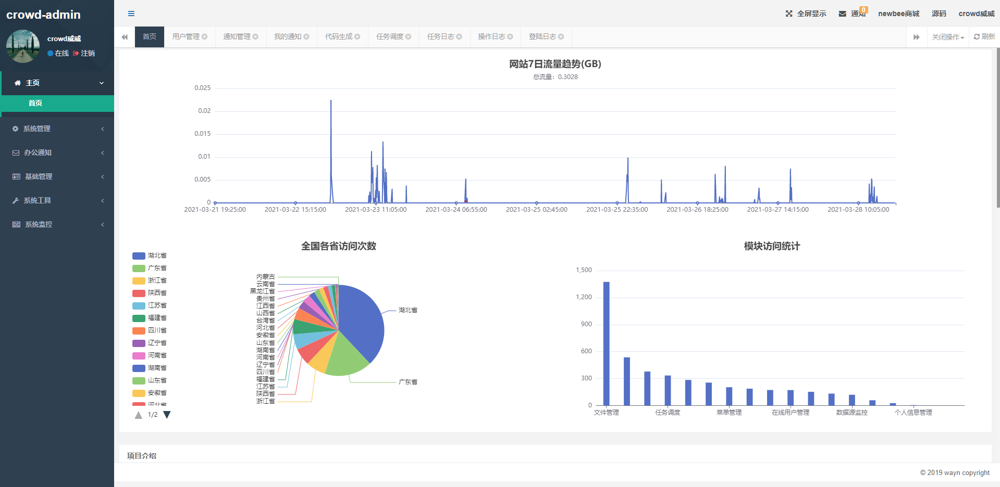
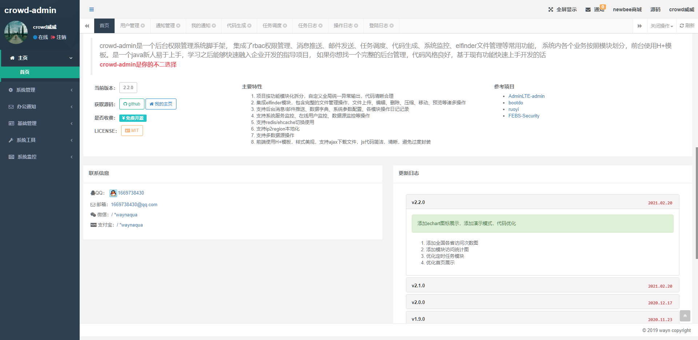
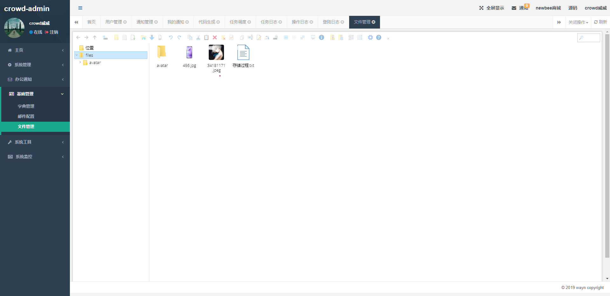

# crowd-admin

### Language
 
- [简体中文](README.md)|[English](README_en.md)

### 项目介绍

crowd-admin是一个后台权限管理系统脚手架，集成了rbac权限管理、消息推送、邮件发送、任务调度、代码生成、elfinder文件管理等常用功能，系统内各个业务按照模块划分，前台使用H+模板。是一个java新人易于上手，学习之后能够快速融入企业开发的指导项目

### 主要特性

- 项目按功能模块化拆分，自定义全局统一异常输出，代码清晰合理
- 集成elfinder模块，包含完整的文件管理操作，包含文件上传、删除、压缩、移动、预览等诸多操作
- 支持后台消息/邮件推送、数据字典、系统参数配置、各模块操作日记记录
- 支持系统服务监控、在线用户监控、数据源监控等操作
- 支持redis/ehcache切换使用
- 支持ip2region本地化
- 支持多数据源操作
- 前端使用H+模板，样式美观，支持ajax下载文件，js代码简洁，清晰，避免过度封装

### 内置模块
 
1. 系统管理
    - 用户管理：系统操作者，可绑定多角色
    - 角色管理：菜单权限携带者，可配置到按钮级权限
    - 菜单管理：配置系统目录，菜单链接，操作权限
    - 部门管理：用户所属部门
    - 日志操作：记录用户操作，包含请求参数
2. 邮件服务
    - 邮件发送：基于activeMQ异步发送邮件
3. 办公通知
    - 我的通知：接收当前用户得通知信息
    - 通知管理：管理员发送并管理通知消息
4. 基础管理
    - 数据字典：对系统中经常使用的一些较为固定的数据进行维护
    - 文件管理：集成elfinder，便于对系统内文件进行查看修改
5. 系统工具
    - 代码生成：可动态根据数据库表，生成后台java代码
    - 任务调度：根据调度策略以及执行目标配置任务调度
    - 任务日志：记录任务日志，方便排错追踪
6. 系统监控
    - 在线用户：当前系统中活跃用户状态监控，可强制下线用户
    - 数据监控：监视当前系统数据库连接池状态，可进行分析SQL找出系统性能瓶颈
    - 系统服务：监视当前系统CPU、内存、磁盘、堆栈等相关信息

### 技术选型

1. 后端
    - 核心框架：Spring
    - 控制层框架：SpringMVC
    - 权限控制：Shiro
    - 消息中间件：activeMQ
    - 消息推送：Websocket
    - 邮件发送：javax.mail
    - 任务调度：Quartz
    - 持久层框架：Mybatis-Plus
    - 日志管理：SLF4J > logback
    - 缓存控制：Ehcache/Redis可切换
    - 环境控制：使用spring profile可根据`-Dspring.profiles.active=dev`参数灵活切换配置文件
2. 前端
    - 模板选型：Jsp
    - 管理模板：H+
    - JS框架：jQuery
    - 数据表格：bootstrapTable
    - 文件管理：elfinder
    - 弹出层：layer 
    - 通知消息：Toastr
    - 消息推送/轮询：sockJs、stomp
    - 树结构控件：jsTree
    - checkbox选择控件：bootstrapSwitch
3. 开发平台
    - JDK版本：1.8+
    - Maven：3.5+
    - 数据库：mysql8+
    - 缓存：ehcache/redis
    - ide：Eclipse/Idea

### 参考教程

- [RuoYi](http://doc.ruoyi.vip/) 文档
- [Mybatis Plus](https://mp.baomidou.com/guide) 文档

### 获取源码

- [crowd-admin github](https://github.com/wayn111/crowd-admin)
- [crowd-admin 码云](https://gitee.com/wayn111/crowdfounding)

### 在线演示

<a href="https://www.wayn.xin/crowd" target="_blank">crowd-admin</a>

### 参考项目

- [AdminLTE-admin](https://gitee.com/zhougaojun/KangarooAdmin/tree/master)
- [bootdo](https://gitee.com/lcg0124/bootdo)
- [RuoYi](https://gitee.com/y_project/RuoYi)

### 实例截图

__系统登陆__

__首页__

__用户管理__

__菜单管理__

__通知管理__

__查看通知__

__文件管理__

__系统服务__

### 特别赞助

