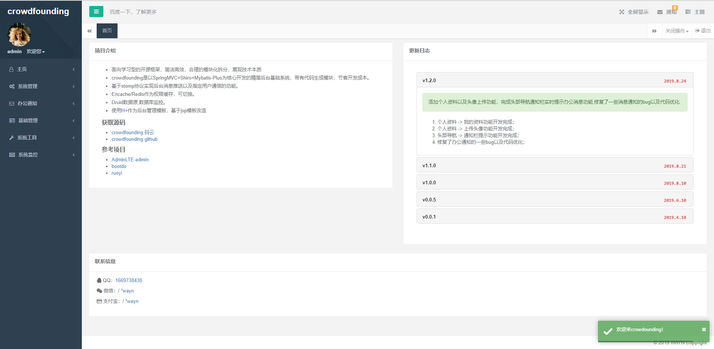
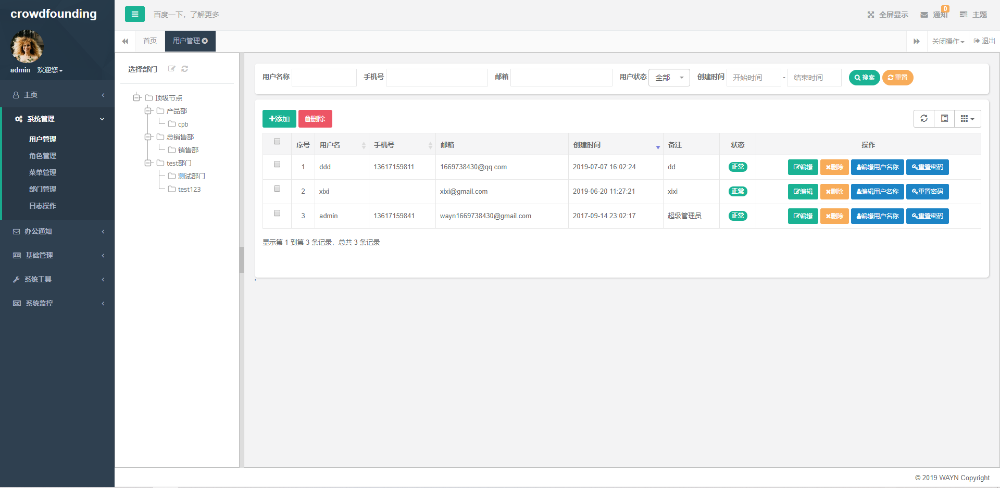
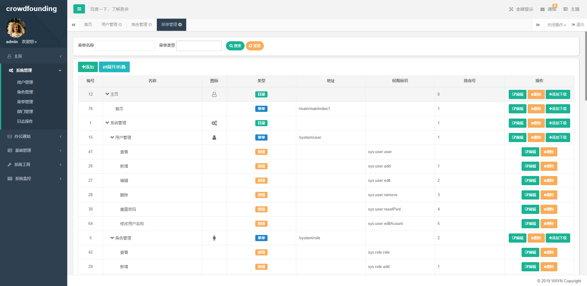
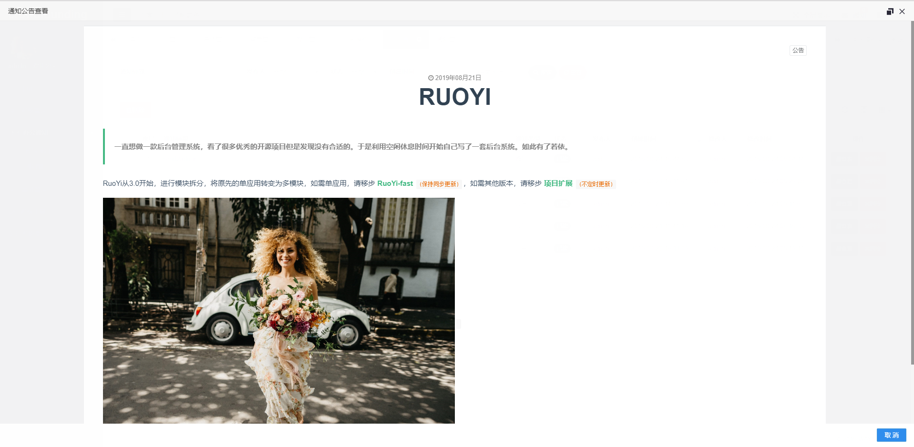
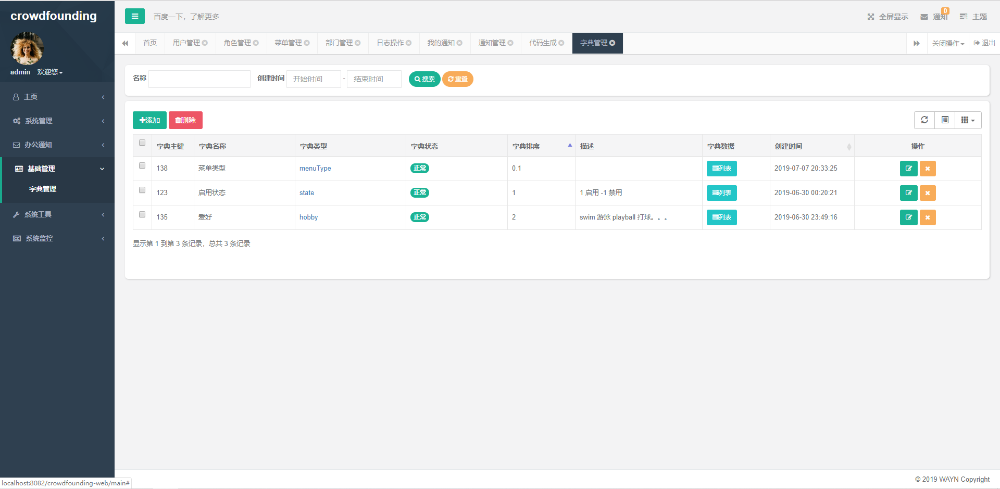

# crowdfounding

### Language
- [简体中文](README.md)|[English](README_en.md)

### Introduction
- Learning-oriented open source framework, simple and efficient, reasonable modular split, showing the essence of technology
- crowd-admin is a streamlined background admin system developed with SpringMVC+Shiro+Mybatis-Plus as the core
- Encache + Redis configuration switch
- Websocket message push
- Druid dataSource and Monitor web page
- Use H+ as a background management template, based on jsp template transformation
- Integrated dictionary management and online users as well as logging
- Add code generation module
- Add server monitor module

### Get Source code
- [crowd-admin gitee](https://gitee.com/wayn111/crowdfounding)
- [crowd-admin git](https://github.com/wayn111/crowdfounding)

### Online demo
- <a href="http://wayn.xin" target="_blank">crowd-admin</a>

### Reference 
- [AdminLTE-admin](https://gitee.com/zhougaojun/KangarooAdmin/tree/master)
- [bootdo](https://gitee.com/lcg0124/bootdo)
- [RuoYi](https://gitee.com/y_project/RuoYi)

### Instance screenshot

-------------
__Login__

__Home__

__userManager__

__addRole__

__menuManager__

__notifyManager__

__notifyView__

__dictManager__

